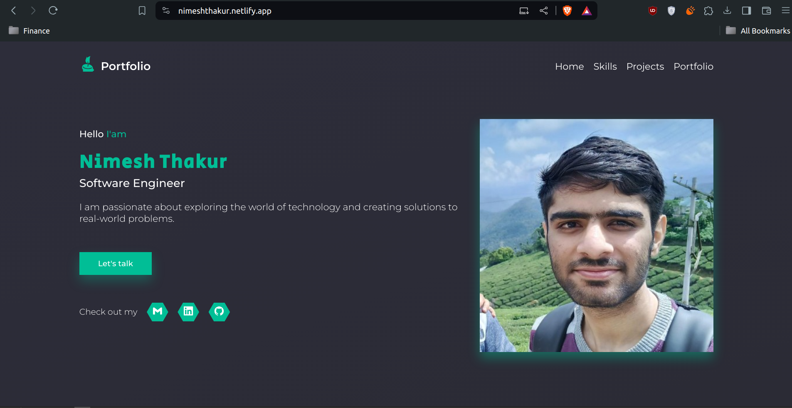
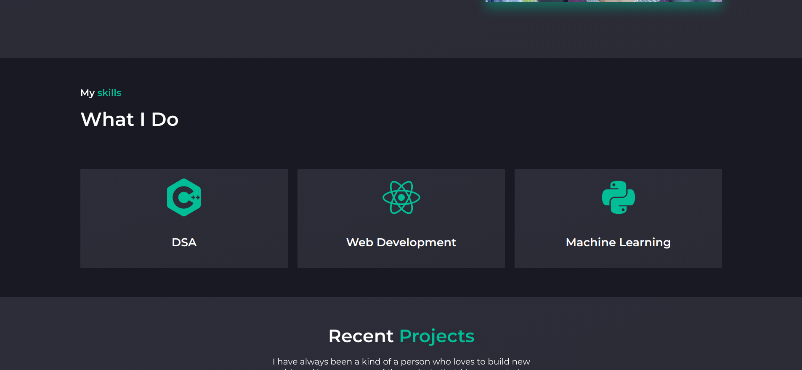
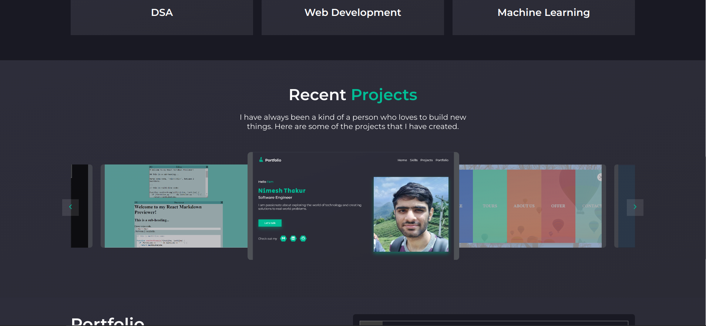
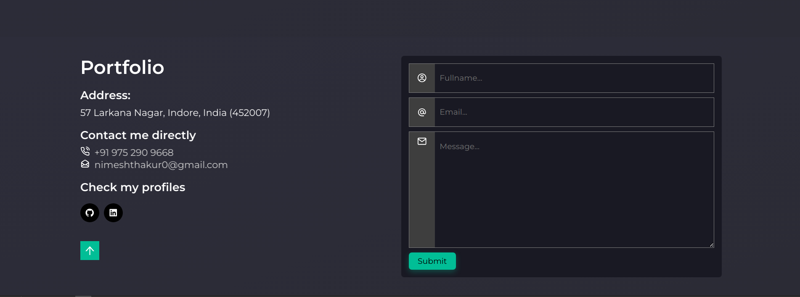

# Portfolio Website

This is a personal portfolio website built using React. It showcases my projects, skills, and services, and includes a contact form for potential clients or employers to reach out to me.

## Features

- Interactive UI with React
- Responsive design for various devices
- Animation effects using react-awesome-reveal
- Carousel for projects using react-slick

## Getting Started

These instructions will get you a copy of the project up and running on your local machine for development and testing purposes.

### Prerequisites

What things you need to install the software and how to install them:

```
Node.js
NPM
```

### Installing

A step by step series of examples that tell you how to get a development environment running:

1. Clone the repository:

```bash
git clone https://github.com/nimeshthakur0/portfolio-website.git
```

2. Navigate to the project directory:

```bash
cd portfolio-website
```

3. Install the necessary dependencies:

```bash
npm install
```

4. Start the development server:

```bash
npm start
```

5. Open [http://localhost:3000](http://localhost:3000) to view it in your browser.

## Usage

Provide examples of how this project can be used. For instance, navigating through the website to explore projects, services, and contacting the developer.

### Screenshots









## Deployment

To build the application for production, run:

```bash
npm run build
```

This builds the app for production to the `build` folder.

## License

This project is licensed under the MIT License - see the [LICENSE.md](LICENSE.md) file for details.
